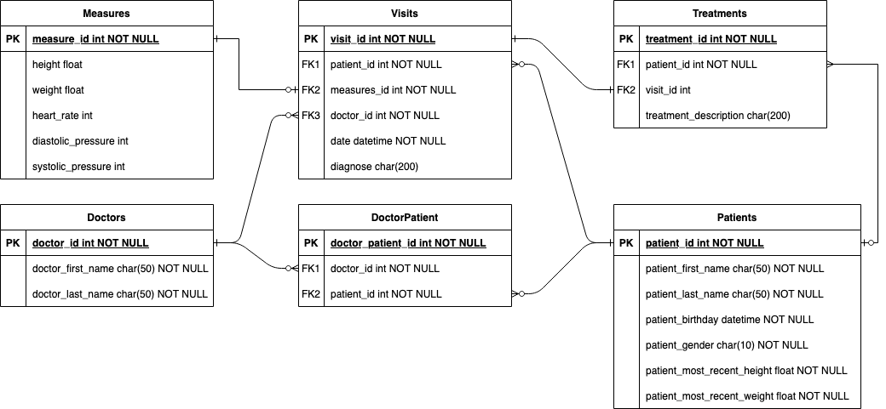

# Part I: Data Model

This section of the repo outlines the data model I designed for the "Medical system" project

## Considerations
The aspects I considered while designing this data models were:
- Optimize for queries. This system is focused on patients and doctors querying information in different forms. This makes me incline towards a relational database which provides more flexibility when running queries
- The model is designed to integrate all fields and information mentioned in the "requirements" regardless of they being implemented in Part 3 or not

## Diagram

## Highlights
- Doctors can have multiple patients and a patient can have multiple doctors
- The model assumes that in order to obtain measures a patient should have had a visit therefore `Visits` are the way to obtain `Measures` information
- A patient can have many treatments and these treatments may or may not be linked to a Visit (e.g., a patient came with a pre-existing condition)
- Since the model was conceived with relational databases in mind, I applied normalization which causes the model to have `DoctorPatient` a table which purpose is to track the m:n relationship between doctors and patients

## Additional Notes
If you want to display the original diagram, download the .drawio file in the `resources` directory and upload it to [draw.io](https://app.diagrams.net/)
