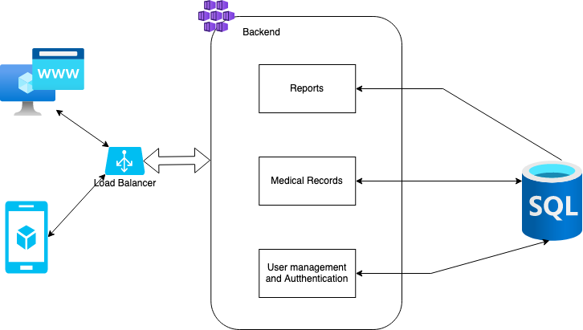

# Part II: System design

## Diagram

## System overview

### Architecture
The way I picture this system is as one with "small" capabilities but with the potential to expand both in functionality and scale.

Based on the requirements I can see that this is a very basic system, and it is one of the reasons I've decided to structure it as a "monolith" rather than a microservices architecture. Microservices are great when you have many different functionalities each one with its own subsets of data, however, for a scenario like this where the functionality is limited, and the data is highly coupled it makes more sense to have everything in just one place.

Scaling is a challenge with monolithic application and because of that, this service would run in multiple instances, allowing it to scale horizontally if the demand grows too much. These instances would sit behind a load balancer to make sure none of them is overloaded or down at any point.

### Database
As mentioned in the data model section, I decided to make use of a relational database (SQL) to store the information of the different users and their treatments.

I would use a MySQL database running on Amazon RDS (or similar) this would allow the database to [scale horizontally and vertically](https://aws.amazon.com/blogs/database/scaling-your-amazon-rds-instance-vertically-and-horizontally/) either changing to a larger hosting VM or by creating replicas

I decided to use a relational DB for two reasons:
- The data across the application is tightly coupled so it makes more sense to keep it in just one place
- The data is diverse and has multiple relations and on top of that it would require different reports which asks for more complex query statements that a NoSQL database doesn't provide.

### Service
The service is structured around 3 modules: User management and Authentication, Medical records and Reports.

#### User management
This module would control user access and relations between doctors and patients.

#### Medical records
Controls all medical information related to a patient, visits, appointments, measures and treatments

#### Reports
This module would oversee generating all the reports required by doctors and patients.

My programming language of choose would be either Java or Python given the large number of libraries available for both languages that would make implementing this service easier.

## Additional Notes
If you want to display the original diagram, download the .drawio file in the `resources` directory and upload it to [draw.io](https://app.diagrams.net/)
